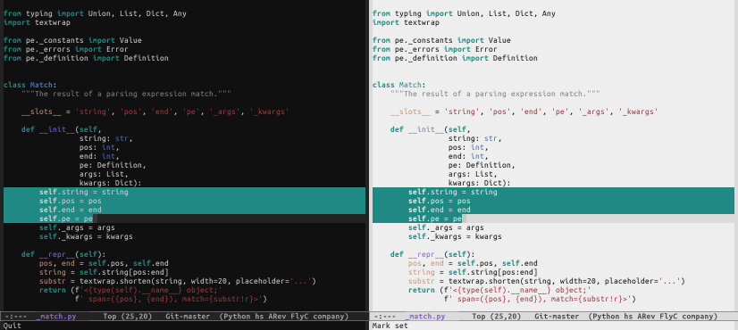

# PDX Carpet Theme for Emacs

This repository has both light and dark Emacs themes inspired by the
old PDX carpet colors (if that means nothing to you, [Wikipedia][wiki]
can help), from a nostalgic Oregonian far from home.

[wiki]: https://en.wikipedia.org/wiki/Portland_International_Airport_carpet

## Installation

Download one or both of the following files:

* [pdx-carpet-dark-theme.el](pdx-carpet-dark-theme.el)
* [pdx-carpet-light-theme.el](pdx-carpet-light-theme.el)

Move them to your themes directory, e.g., `~/.emacs.d/themes/`.

For more info see <https://www.emacswiki.org/emacs/ColorThemes>.

## Questions and Answers

### How was it made?

I started with a photo of the carpet, took averaged samples of several
elements, plugged them into [ThemeCreator], then adjusted some colors
a bit to make them more legible. Each photo will have different colors
(whether its from camera settings, filters, or how faded the carpet
itself is), so there's room for further adjustments. I'm happy for any
improvements to the theme!

[ThemeCreator]: https://mswift42.github.io/themecreator/

### Is it on (M)ELPA?

Not yet.

### Why isn't the default background teal like the real carpet?

Because that would be awful. Instead, the region background is teal
(see screenshots).
